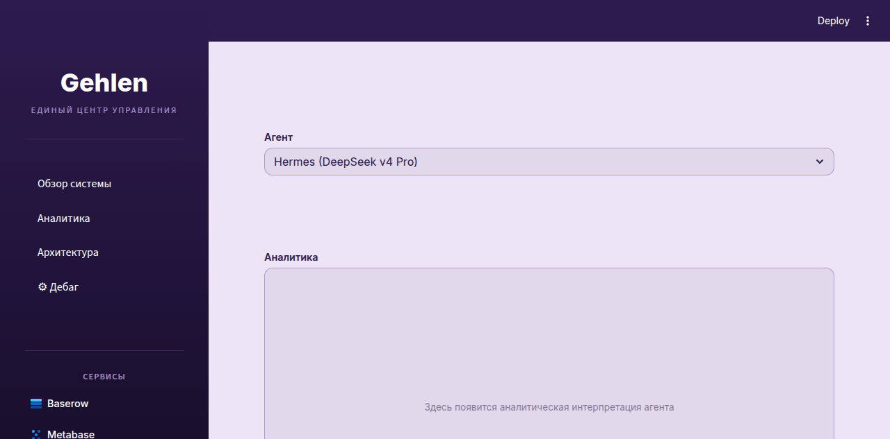

# AI-Powered E-commerce Analytics Platform

**Система сквозной аналитики для маркетплейсов Wildberries и Ozon с AI-ассистентом.**

---

## Как это работает

```
┌─────────────────────────────────────────────────────┐
│                  Источники данных                    │
│         Wildberries API  │  Ozon API                │
└──────────────────────┬──────────────────────────────┘
                       │
                       ▼
┌─────────────────────────────────────────────────────┐
│              Универсальные загрузчики                │
│   wb_sales_loader │ wb_realization_loader │ ...     │
│   ozon_finance_v2_loader │ ozon_postings_loader     │
│         ↓ сандализация на 2023 год ↓                │
└──────────────────────┬──────────────────────────────┘
                       │
                       ▼
┌─────────────────────────────────────────────────────┐
│                Оркестратор + Baserow                 │
│     wb_orchestrator.py → baserow_manager.py          │
│              ↓ PostgreSQL (реляционные данные) ↓     │
└──────────────────────┬──────────────────────────────┘
                       │
          ┌────────────┼────────────┐
          ▼            ▼            ▼
┌──────────────┐ ┌──────────┐ ┌──────────┐
│   Metabase   │ │ Аналитика│ │  Дебаг   │
│ (визуализация)│ │  (AI)    │ │  (AI)    │
│   :3001      │ │DeepSeek  │ │DeepSeek  │
└──────────────┘ │  API     │ │  API     │
                 └──────────┘ └──────────┘
                       │
                       ▼
┌─────────────────────────────────────────────────────┐
│              UI Dashboard (Streamlit :8501)          │
│    Обзор системы │ Аналитика │ Архитектура │ Дебаг   │
└─────────────────────────────────────────────────────┘
```

---

## Структура проекта

```
├── loaders/                       # Загрузчики данных из API маркетплейсов
│   ├── wb_sales_loader.py         # WB — продажи
│   ├── wb_realization_loader.py   # WB — реализация
│   ├── wb_ads_loader.py           # WB — реклама
│   ├── ozon_finance_v2_loader.py  # Ozon — финансы
│   ├── ozon_postings_loader.py    # Ozon — отправления
│   ├── ozon_realization_loader.py # Ozon — реализация
│   ├── ozon_transactions_detail_loader.py  # Ozon — транзакции
│   ├── ozon_vendor_loader.py      # Ozon — поставщик
│   └── ozon_ads_loader.py         # Ozon — реклама
│
├── analytics/                     # Ядро аналитики
│   ├── wb_base_loader.py          # Базовый класс загрузчиков WB
│   ├── wb_orchestrator.py         # Оркестратор пайплайна
│   ├── runner.py                  # Главный запускатор
│   ├── baserow_manager.py         # Клиент Baserow API
│   └── fin_analyst.py             # Финансовый аналитик
│
├── dashboard/                     # Streamlit UI дашборд
│   ├── app.py                     # Главное приложение
│   ├── arch_block.py              # Страница «Архитектура»
│   ├── export_baserow_to_postgres.py  # ETL-мост Baserow → PostgreSQL
│   └── modules/
│       ├── analytics_sandbox.py   # AI-аналитика (DeepSeek API + Plotly)
│       ├── debug_agent.py         # AI-дебаг (анализ и исправление кода)
│       ├── docker_manager.py      # Управление Docker-контейнерами
│       ├── finance_provider.py    # Финансовая сводка (из Baserow)
│       ├── loader_runner.py       # Запуск и мониторинг загрузчиков
│       ├── ollama_manager.py      # Управление Ollama (стационар)
│       └── status_engine.py       # Проверка статусов всех сервисов
│
├── docker-compose.yml             # Docker-инфраструктура
├── docs/screenshots/              # Скриншоты интерфейса
├── .env.example                   # Шаблон переменных окружения
└── README.md
```

---

## Ключевые модули

| Модуль | Назначение |
|---|---|
| **loaders/** | 9 загрузчиков — сбор сырых данных из API WB и Ozon |
| **analytics/wb_orchestrator.py** | Координация загрузки, агрегации и записи в Baserow |
| **dashboard/modules/loader_runner.py** | Управление загрузчиками из UI (вкл/выкл/перезапуск) |
| **dashboard/modules/analytics_sandbox.py** | AI-генерация pandas-кода по запросу на русском → Plotly-график |
| **dashboard/modules/finance_provider.py** | Авто-обнаружение таблиц Baserow, расчёт прибыли/ДРР/продаж |
| **dashboard/modules/debug_agent.py** | Сканирование проекта, поиск багов и устаревших endpoints |

---

## Стек

`Python` `Streamlit` `Docker` `PostgreSQL` `Baserow` `Metabase` `Qdrant` `DeepSeek API` `Ollama` `Tailscale`

---

## Скриншоты





---

## Автор

**Дмитрий Грузинов** — основатель GEHLEN LANER, руководитель AI-проектов.

📧 gruzinov.dmitry.sergeevich@gmail.com
