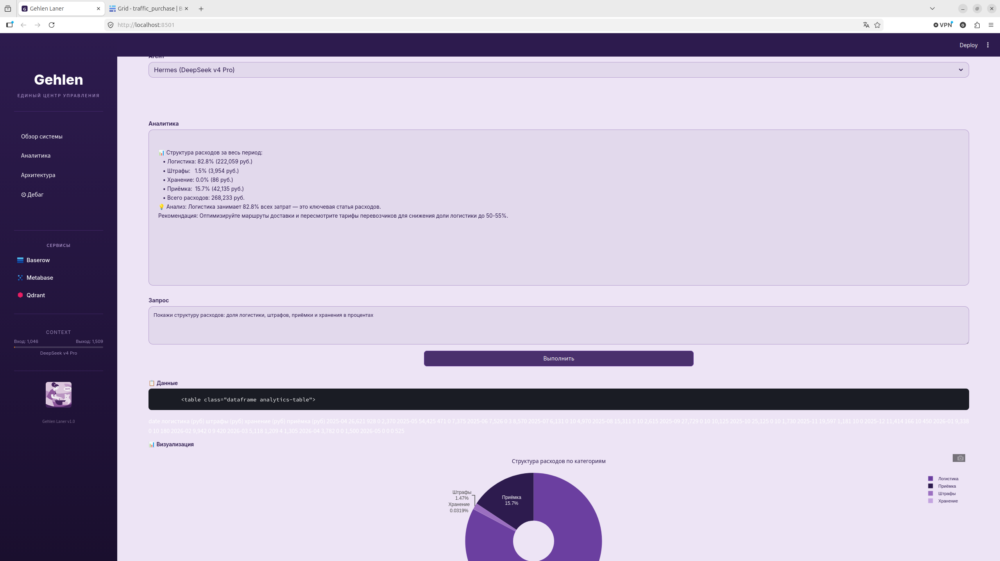
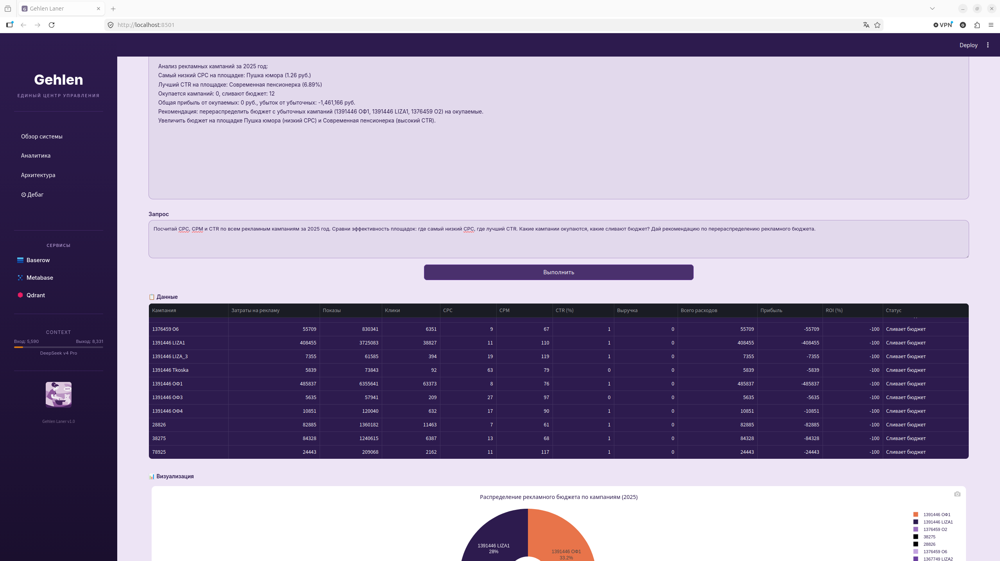
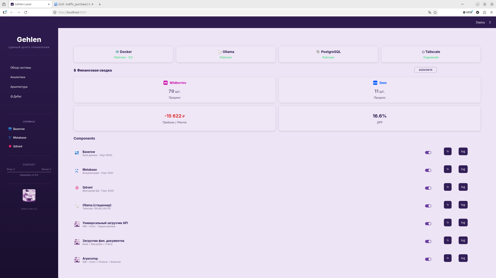
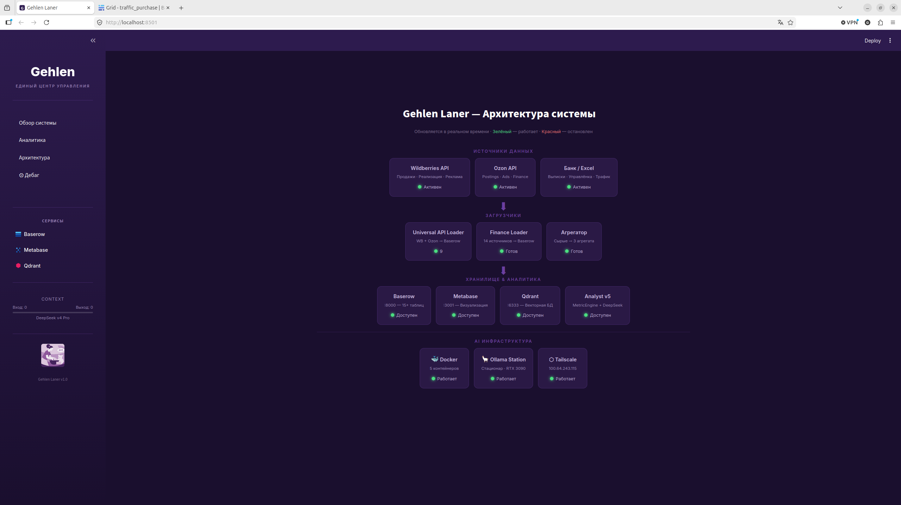

# AI-Powered E-commerce Analytics Platform

**Система сквозной аналитики для маркетплейсов Wildberries и Ozon.**

---

## Как это работает

```
WB API / Ozon API                Google Sheets / Excel
       │                                 │
       ▼                                 ▼
┌──────────────────┐          ┌──────────────────┐
│ universal-api-   │          │  finance-loader  │
│ loader           │          │  банк, реклама,  │
│ сырые данные     │          │  управленка      │
└────────┬─────────┘          └────────┬─────────┘
         │                             │
         └──────────────┬──────────────┘
                        ▼
              ┌──────────────────┐
              │     Baserow      │
              │  (PostgreSQL)    │
              │ единое хранилище │
              └────────┬─────────┘
                       │
        ┌──────────────┼──────────────┐
        ▼              ▼              ▼
┌────────────┐  ┌────────────┐  ┌────────────┐
│ aggregator │  │  Metabase  │  │ analytics  │
│ агрегация  │  │ визуализац.│  │ AI-аналит. │
│ по дням    │  │   :3001    │  │ DeepSeek   │
└─────┬──────┘  └────────────┘  └─────┬──────┘
      │                               │
      └───────────────┬───────────────┘
                      ▼
           ┌──────────────────┐
           │    Dashboard     │
           │  Streamlit :8501 │
           │  4 страницы      │
           └──────────────────┘
```

**Qdrant** (векторная база данных) поднимается через Docker и хранит неструктурированные данные (договоры, документацию). Участвует в аналитике как дополнительный источник данных.

---

## Структура

```
├── universal-api-loader/         # Универсальный загрузчик WB/Ozon API
│   ├── src/universal_loader.py
│   ├── src/validate_config.py
│   ├── configs/ozon/             # 5 JSON-конфигов
│   └── configs/wildberries/      # 4 JSON-конфига
│
├── finance-loader/               # Финансовый загрузчик
│   ├── src/finance_loader.py
│   └── configs/                  # 8 JSON-конфигов
│
├── aggregator/                   # Агрегация в ежедневные сводки
│   ├── src/aggregator.py
│   └── configs/aggregation_rules.json
│
├── analytics/                    # AI-аналитика
│   ├── analyst.py                # Оркестратор (точка входа)
│   ├── config.yaml
│   └── src/
│       ├── data_discovery.py     # Авто-обнаружение таблиц
│       ├── data_linker.py        # Поиск связей
│       ├── metric_engine.py      # Расчёт метрик (ДРР, ROMI)
│       ├── model_provider.py     # AI-модели
│       └── sandbox.py            # Песочница
│
├── dashboard/                    # Streamlit UI
│   ├── app.py
│   └── modules/
│       ├── debug_agent.py        # AI-дебаг проекта
│       ├── finance_provider.py   # Финансовая сводка
│       ├── loader_runner.py      # Управление загрузчиками
│       ├── docker_manager.py     # Docker-контейнеры
│       ├── ollama_manager.py     # Ollama-станция
│       └── status_engine.py      # Статусы сервисов
│
├── docs/screenshots/             # Скриншоты
├── docker-compose.yml            # Docker-инфраструктура
├── .env.example
├── .gitignore
└── README.md
```

---

## Стек

`Python` `Streamlit` `Docker` `PostgreSQL` `Baserow` `Metabase` `Qdrant` `DeepSeek API` `Ollama` `Tailscale`

---

## Скриншоты






---

## Автор

**Дмитрий Грузинов** — основатель GEHLEN LANER.

📧 gruzinov.dmitry.sergeevich@gmail.com
